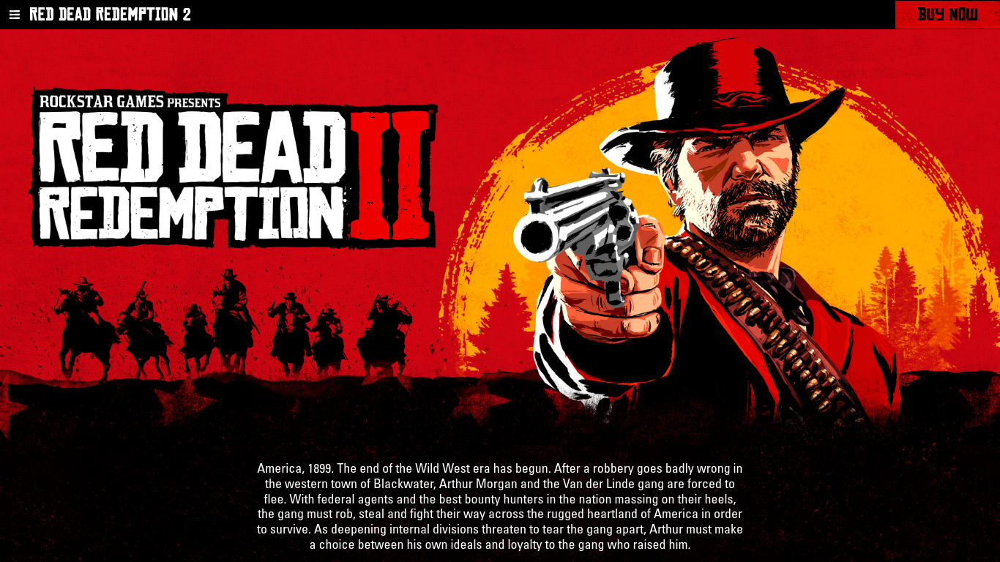
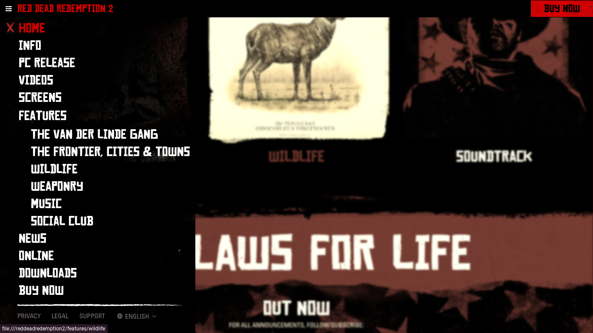
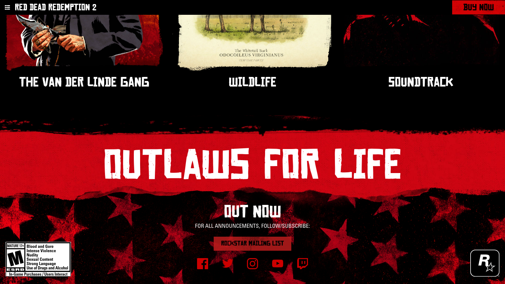

# Trying to Clone the RDR2 Site
Well... basically, I decided to, at least try, to use the [Wayback Machine](https://web.archive.org) to recreate the Red Dead Redemption 2 website as it was in 2023 (currently it looks outdated compared to 2023). Why? Because I liked it, it's a pretty well-designed site, and I also like the game.

I know, the code is a mess, but I'm going to try to fix it little by little, with some help too.

# Screenshots






# Notes
- Remember, I used web.archive.org to retrieve all the files and code. Specifically, from ```https://web.archive.org/web/20230815011942cs_/https://www.rockstargames.com/reddeadredemption2```.

- No, the [main HTML code](./index.html) is not the original. I had to make some changes, remove some elements, and add [important JavaScript](./assets/js/script.js).

- What remains to be done:
  - Download more images referenced in the [main CSS](./assets/css/2455f5211be05b218519.css) (just search for "/web/20200524223229im_" in the main CSS).
  - Somehow obtain the code from the sub-sites like ```https://www.rockstargames.com/reddeadredemption2/features/weaponry```, ```https://www.rockstargames.com/reddeadredemption2/features/wildlife```, and so on, from the Wayback Machine. So far, only the 2023 version of [```https://www.rockstargames.com/reddeadredemption2```](./index.html) is definitive. To check what's left, simply explore ```https://www.rockstargames.com/reddeadredemption2``` in your browser to find more directories containing different information about RDR2.
  - Fix the links called in the [main HTML code](./index.html), in the [main CSS](./assets/css/2455f5211be05b218519.css), and in [d0f410feafebf36c8443.js](./assets/js/d0f410feafebf36c8443.js), and probably a few more. Either download the file, associate the partial link found with the following site: https://web.archive.org/-partial-link-, and place the downloaded file in ```assets``` and in the corresponding directory, or remove it if it serves no purpose, or fix the alternation of languages in the navbar, etc.

## Contributions

Contributions are welcome and needed! Feel free to open issues or send pull requests to enhance this project.

<a href="https://visitorbadge.io/status?path=https%3A%2F%2Fgithub.com%2Fd4v1-sudo%2Frdr2-2023-site-clone"></a>
